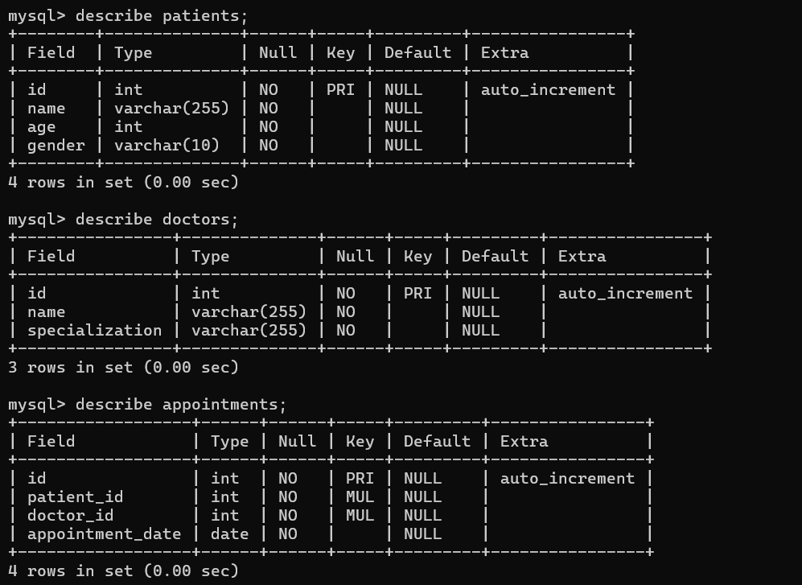

# 🏥 Hospital Management System

> A **Java + MySQL** based console application for managing hospital operations, built with clean code practices and a scalable structure.
> Designed to simulate real-world hospital management tasks like handling patients, doctors, and appointments — all from a terminal interface.

---

## 🚀 Features

### 👨‍⚕️ Patient Management

* Add new patients with basic details
* View all registered patients
* Delete patient records

### 🩺 Doctor Management

* Add new doctors with specialization
* View doctor listings
* Delete doctor records

### 📅 Appointment Handling

* Book patient appointments with doctors
* View all scheduled appointments
* Cancel existing appointments

### 🖥️ User Interface

* Interactive console menu
* Clear prompts for input and validation
* Static sample data available for quick demos

---

## 🛠️ Tech Stack

| Technology | Purpose                 |
| ---------- | ----------------------- |
| **Java**   | Core application logic  |
| **JDBC**   | Database connectivity   |
| **MySQL**  | Persistent data storage |
| **SQL**    | CRUD operations         |
| **Git**    | Version control         |

---

## 📂 Project Structure


```

Hospital Management System/
├── .idea/                                # IDE-specific settings (e.g., IntelliJ IDEA)
├── sql/                                  # Database-related files, like schema scripts
├── src/                                  # Source code directory
│   └── HospitalManagementSystem/         # Main Java package
│       ├── Doctor.java                   # Represents the Doctor entity; likely contains attributes and methods for doctors
│       ├── HospitalManagementSystem.java # The main entry point of the application
│       └── Patient.java                  # Represents the Patient entity; contains attributes and methods for patients
├── .gitignore                            # Specifies files and directories to be ignored by Git
└── Hospital Management System.iml        # IntelliJ IDEA module file; defines project structure and dependencies

```

---

## ⚡ How to Run Locally

1️⃣ **Clone the repository**

```bash
git clone https://github.com/tuhinsunny/Hospital-Management-System.git
cd Hospital-Management-System
```

2️⃣ **Setup MySQL Database**

* Open MySQL terminal or GUI
* Run the `hospital_db.sql` script:

```sql
source path/to/hospital_db.sql;
```

3️⃣ **Configure JDBC**
Update your `HospitalManagementSystem.java` file with your MySQL credentials:

```java
private static final String url = "jdbc:mysql://localhost:3306/hospital_db";
private static final String username = "root";
private static final String password = "yourpassword";
```


---

## 📸 Screenshots

## Main Menu
<p align="center">
  
</p>

## Database Schema
<p align="center">
  
</p>

---

## 🎯 Why This Project Stands Out

✅ **Clean, modular Java code** — easy to extend with new features
✅ **SQL-backed persistent storage** — realistic data handling
✅ **Static sample data** — instantly test without manual entry
✅ **Practical real-world problem solving** — applicable to healthcare scenarios
✅ **Git best practices** — meaningful commits and proper structure

---

## 🔮 Possible Future Enhancements

* GUI version using **JavaFX** or **Swing**
* User authentication and role-based access (Admin, Receptionist, Doctor)
* Data analytics for patient visits and doctor performance
* Cloud database integration for remote access


---

## 🤝 Connect with me

💼 [LinkedIn](https://www.linkedin.com/in/tuhin-chandra-a675ab250/) <br/>
📧 [Gmail](mailto:tuhinchandra2k04@gmail.com)

---

